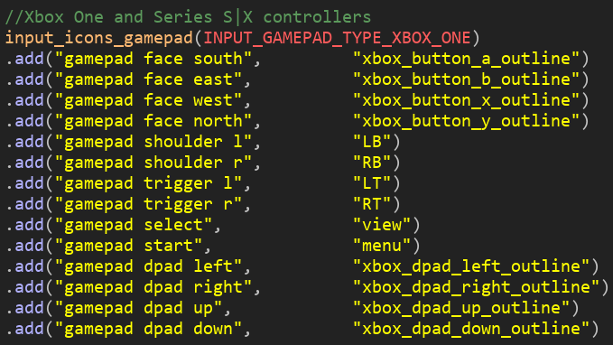
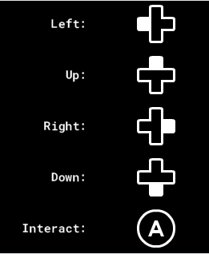

---

title: Auto-swapping Input Prompts Icons with Input
description: A guide on automatically swapping on-screen input prompts using the Input library
date: 2024-06-17 18:35:07
tags:
  - input
authors:
  - Els

---

Hi there, and welcome back to Spider Lily Studios GameMaker Tutorials, part 3! This installment is sponsored by Tom, who requested a tutorial for displaying input prompt sprites that change automatically depending on what type of controller is connected, using the Input library. I’m also going to be adding some very simple Scribble/Chatterbox functionality too, using Scribble’s in-line sprite display. Our plan is to create both a simple controls menu, and a line of tutorial dialogue that displays a sprite.

# Getting Started

First, if we want to draw icons, we’re going to need icon sprites. For this, we’re going to be using Kenney’s free Input Prompts pack, because it has everything we need.

In your project, find the __input_config_icons script. You’ll notice there’s sections labelled “//Xbox”, “Playstation 5”, etc, and underneath them, lot of lines that look like this.

``` .add("gamepad face south",     	"A")```

The first variable here is the “generic” name of a given input, much like the generic verbs (e.g. “interact”) from the last tutorial. The right is the name of the controller-specific sprite you want to associate it with (as a string, within double quotes.) So for example, since I’m too lazy to change the default names of the Kenney sprites, I’m going to change this line to:

```.add("gamepad face south",     	"xbox_button_a_outline")```

I’d be here all day if I did all of them, so as examples I’m just doing the face buttons and dpads for Xbox, Switch and Playstation. Should look something like this:



Great! So ... what about the keyboard and mouse? Scroll back up and look for this line:

```//Optional remapping for keyboard and mouse```

As the comments explain, Input will automatically grab the keyboard key as a string, but you can set custom sprites here. I’m going for the three choice number keys, WASD, the arrows, and Z, X, and C. Put them underneath input_icons_keyboard_and_mouse().

```gml
.add("num1",     	"keyboard_1_outline")
.add("num2",     	"keyboard_2_outline")
.add("num3",     	"keyboard_3_outline")
.add("c",   		  "keyboard_c_outline")
.add("z",   	  	"keyboard_z_outline")
.add("x",        	"keyboard_x_outline")
.add("w",        	"keyboard_w_outline")
.add("a",        	"keyboard_a_outline")
.add("s",        	"keyboard_s_outline")
.add("d",        	"keyboard_d_outline")
.add("left",     	"keyboard_arrow_left_outline")
.add("up",       	"keyboard_arrow_up_outline")
.add("right",    	"keyboard_arrow_right_outline")
.add("down",     	"keyboard_arrow_down_outline")
```


We’re also going to do some quick housekeeping in __input_config_verbs. Under “gamepad”, edit the first four lines as follows, and add a fifth for “interact”:


Now our console inputs are matched to our keyboard ones! I swapped the order of the first four lines because I already decided I wanted to use the dpad icons.

# Detecting And Displaying Input Type

Okay, that’s the worst part. Now we have icons for multiple types of input. We want to be able to detect which input type we have, and use that to display a sprite. Fortunately Input makes that pretty easy! It can actually auto-detect what source is connected. If you’re just using one player, the “hotswap” functionality will switch the default player to whatever the most recent detected source is (look inside the “hotswap” config file for more information on this!)

The information we need Input to tell us is “what button is currently bound to the verbs we want to display?” And to get that, we’re going to use a nice little script whipped up by Tom. Make a new script and call it “get_binding_icon”:

```gml
function get_binding_icon(verb)
{
    ///Originally by Tom. Thanks, Tom!
	if (is_string(verb) == false)
	{
		show_debug_message("get_binding_icon: " + string(verb) + " is not a string");
		return undefined;
	}
	
	var binding = input_binding_get(verb);
	var icon = input_binding_get_icon(binding);
	
	if (asset_get_type(icon) != asset_sprite)
	{
		show_debug_message("get_binding_icon: " + string(icon) + " is not a sprite");
		return undefined;
	}
	
	return icon;
}
```

What this does is, when fed the name of a verb, it checks to see if there’s a corresponding binding, and then if there’s an icon assigned to that binding. So for our “interact”, that’s:
Verb: “interact”
Binding: “LMB” (if the mouse is connected)/”gamepad face south” (if Xbox controller)/etc
Icon: “mouse_left_outline”/”xbox_button_a_outline” (as above)

Okay! We have our icon. Now let’s display it!

I’m going to start by making a very basic HUD, and to do that I’m going to create an object called oHUD.

oHUD gets a Create event, where I’m going to set: 

```gml
game_w = window_get_width();
game_h = window_get_height();
```

(In a more complicated game with things like window resizing this would be different, but we’re keeping it simple here.)

Under that, I’m going to make an array.

```controls = ["Left","Up","Right","Down","Interact"];```

... and do some preliminary calculations.

```gml
longStringW = string_width("Interact");

spriteW = sprite_get_width(keyboard_1_outline);
spriteH = sprite_get_height(keyboard_1_outline);
colonPos = game_w - (spriteW*2);
```

You can probably see where I’m going with this. I’m being a bit lazy here since I know what sprite and string I need to measure and I only need to do it once; again, if you’re working with multiple screen or text sizes you’d need to do this dynamically.


Then, in Draw GUI, we pick a starting place and colour:
```gml
var _x = colonPos - longStringW;
var _y = 50;

draw_set_color(c_white);
```

... and draw our array! (I love repeat functions.) Note that we use asset_get_index to turn our icon name (as a string) into the actual sprite index that GameMaker can read.

```gml
var _i = 0;
repeat(array_length(controls)) {
    draw_text(_x - string_width(controls[_i]),_y,controls[_i]+":");
    
    //Find out what sprite is currently assigned to each control
    var _controlSprite = get_binding_icon(string_lower(controls[_i]));
    if _controlSprite != undefined draw_sprite(asset_get_index(_controlSprite),0,_x+spriteW,_y-(spriteH/3));
    
    _y += spriteH;
    
    _i +=1;
    
}
```

And when we turn it on ...



... I don’t have an Xbox controller handy, so I told GameMaker to use it as the default. Then I used my mouse, and finally a Joycon connected via bluetooth. Et voila!

Finally, I wanted to display one of the sprites as an in-line sprite with Scribble. For that, I’m going to introduce you to an important concept: the Chatterbox Variable, or as I call them, cvars. Here’s what you need to know about cvars:
* Chatterbox can’t read variables directly from GameMaker, so we need to use ChatterboxVariableGet() and Set() to hold them.
* Chatterbox variables are stored as pairs of “variable name” and “value”. The name is a string; the value can be a string, a number, or a boolean

It’s best practise to declare your Chatterbox variables at initialisation. I’ll be doing mine in the Create event of oInit. This is why initialisation objects are so handy!

In the Create event of oInit, add these lines:

```gml
ChatterboxVariableDefault("interact","LMB");
ChatterboxVariableDefault("interactSprite","mouse_left_outline");
```

I’m assuming most people will play with a mouse and keyboard, so I’m setting the default interact key to be the left mouse button, or LMB. You can make it whatever you like as long as it matches one of the bindings from the icons config!

Next, we’re going to use the combined functionality of Scribble and Chatterbox with this line of dialogue in our yarn file.

```gml
"Press [{$interactSprite},0] ({$interact}) to continue."
```

How does this work? 
* Scribble’s in-line sprite function is formatted as [sprite_name,frame], taking a string and an integer respectively. That means we don’t have to feed it the sprite index—just its name as a string ...
* ... Which, conveniently, is what we get when we use the {$variable} formatting to print a variable inline.

Here’s how it currently looks: 


But what happens if we change to a different input source? Currently nothing, but we can change that! We’re gonna make a new script and call it “cvar_update_binding”. Add these lines:

```gml
var intBinding = input_binding_get_name(input_binding_get("interact"))
ChatterboxVariableSet("interact",intBinding);
ChatterboxVariableSet("interactSprite",get_binding_icon("interact"));
```

Note that the name returned by input_binding_get_name is, per the documentation, a predetermined “human readable name”. If you want to customise this, you could e.g. write your own switch statement depending on what you want to display in place of that first line. I’m just going to use the Input default.

So, we want this to be called when Input detects a hotswap. Fortunately, again, Input has already thought of this. Back in oInit, add this line:

```gml
input_hotswap_params_set(cvar_update_binding);
```

That tells Input to run our update script when it does its hotswap thing. Convenient! Here’s how it looks in action:


Some things to note:
* You can’t force the Chatterbox to refresh its variables, and thus the sprite/verb name, while they’re being displayed, unfortunately. Or, you might be able to finagle it, but I couldn’t get it working.
* That awkward “gamepad face south” is why you would probably want to use your own names.

And there you have it! Dynamically displaying control prompts in Input. As always, check out the updated example project over on [Itch](https://spiderlilystudios.itch.io/scribblebox-for-gamemaker), feel free to leave a tip there or on [Ko-fi](https://ko-fi.com/spiderlilystudios) if you found it helpful, and get in touch if you’re interested in sponsoring a tutorial!
